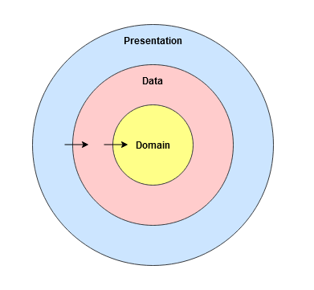
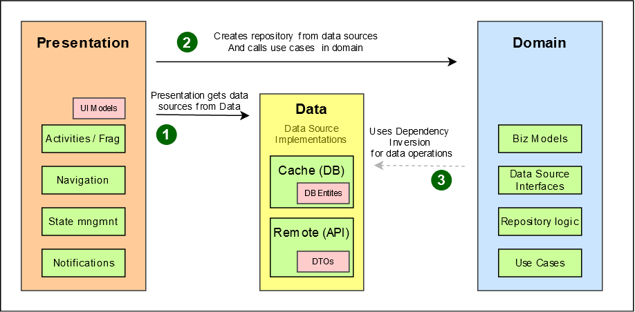
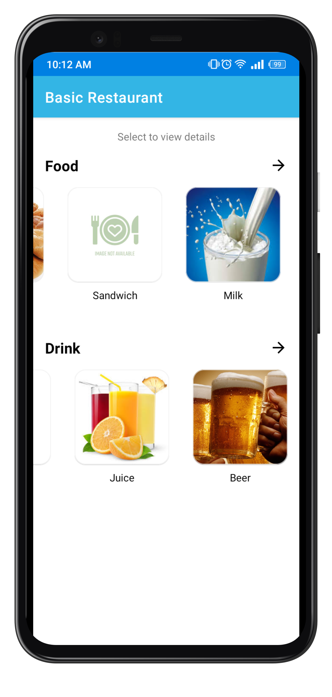
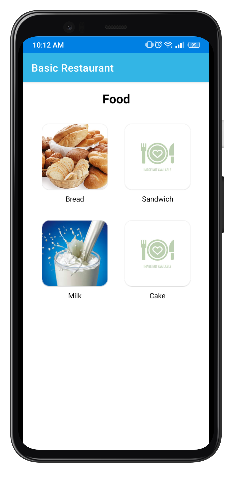
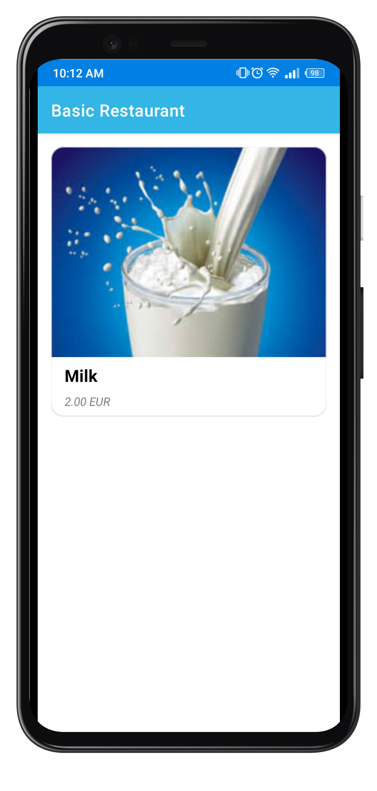

# Welcome to Basic Restaurant!

It's an app built using the MVVM, Repository Pattern and Clean Architecture. It uses the [RestaurantProducts API](http://mobcategories.s3-website-eu-west-1.amazonaws.com/) and displays all the products of the restaurant under specific categories.

# Key Features:
1. **Separation of Concerns:** The app is built using Uncle Bob's clean architecture (see architecture section below)
2. **No UI management code** left in activities and fragments by using ViewModels and DataBinding
3. **Navigation logic** separated out using Navigation Component. All UI components are  responsible for their own navigation based on events known to them.
4. **Reusable List Adapter** which is used to generate 3 different lists, without any code in Activities or Fragments!

# Architecture
The app is built with scalability in mind. To maintain the separation of concerns, [Clean Architecture](https://blog.cleancoder.com/uncle-bob/2012/08/13/the-clean-architecture.html) by Robert C. Martin, is used. The diagram below shows how the clean architecture is mapped to this android application 

### Flow of control:
Flow of control is one directional only. Any outer layer doesn't know about the inner layer. If an inner layer needs to communicate to an outer layer, it is done via Dependency Injection. 

To maintain this separation over the time of project, separate modules have been used for each layer.

### Domain Module

This is a pure Kotlin module. As such it is platform dependent and can be reused any where (Web, iOS, Desktop etc). Domain module contains:

- **Business Models** - POKOs
- **Data Source Interfaces** - This definition of data sources allows the app to substitute the DB or remote implementations any time without breaking the logic.
- **Repositories** - Repository definitions and implementations are both part of Domain. No matter how the data sources are implemented (db, in memory, in-file), Repository has the business logic to choose the right data source for returning the data
- **Use Cases** - These represent the user interactions with the system and contain business logic.

Note: Domain is totally unaware about the rest of the system.

### Data Module

Data module contains persistent and remote data source implementations. It implements all the data source interfaces provided by the domain module. 

Data module has separate data models for each data source. It is the responsibility of data module to transform this data to business model before return it back. This ensures that actual implementation of the data sources can be changed any time without affecting the rest of the system.

Currently, data module uses Room and Retrofit which are platform dependent. However, by using SQLDelight and Ktor, this module can also be made platform independent.

### Presentation Module
This module contains all the platform specific, i.e. Android code. It is responsible for User Interface and handling user actions. 

Presentation module is dependent on both domain and data modules. Presentation module has its own UI models but when triggering a use case, presentation module will always use business model objects.

It is the job of presentation module to provide the data module implementations to domain module for business logic execution.

# Testing Strategy

Since the domain module is the most reusable module, it was given the most attention when testing. It was written using **TDD** and is **100%** tested.

Data module has the two boundary components of our application, DB and server API:
- DB is tested using **InMemory RoomDB** mock provided by Android. 
- The API communication is tested by **MockWebServer** provided by okhhtp3.

### State-based vs. Behavior-based:
Most of the testing is stated-based by creating fakes or using InMemory RoomDB and MockWebServer. However, at a few places where it makes more sense, behavior-based testing is used.

### Testing Libraries:
- **JUnit4** - Unit testing framework
- **Mockito** - Creating test doubles
- **MockWebServer** - For mocking the API response
- **InMemory Room DB** - For mocking local database
- **Google Truth** - For fluent, readable assertions
- **Turbine** - For easier testing of Kotlin flows.

# Screenshots

  

# Libraries

- **Material Design** - UI design
- **AndroidX** - ViewModel, LiveData
- **KotlinX** - Coroutines, Flow, StateFlow, Serialization
- **Hilt** -  Dependency Injection
- **Navigation Component** - User navigation
- **Glide** - Loading Images
- **Room** - Database Storage
- **Retrofit** - API Calls

# Future Enhancements
1. Ids and prices shared by server are in string. They should be serialized to Long and Float when data is received using KSerializers.
2. Comparator used in DataBoundRecyclerView should be dynamic. The data element should be able to pass a custom comparator using xml at the time of creation of adapter.

# Known Bugs
1. **Snackbar Issue:** When internet is not available, CacheFirstStrategy emits an invalid resource with error message and immediately after, emits a Valid resource from cache. The time interval between both is very minute and StateFlow only holds the latest value. This causes the Invalid message to not reach UI and error is not shown. A temporary fix for now is done by adding a 500ms delay after emitting Invalid .

